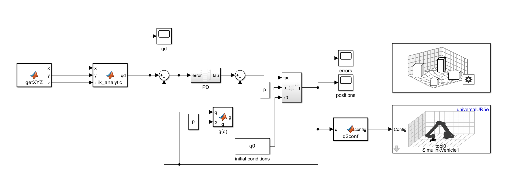
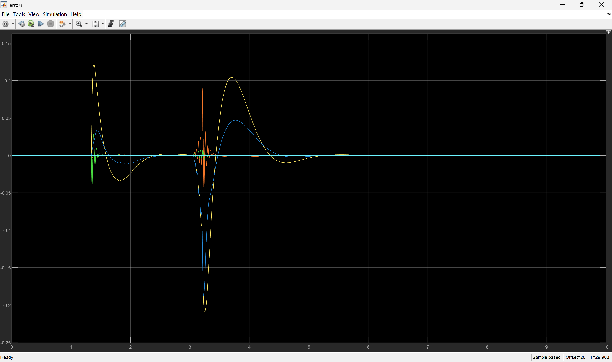
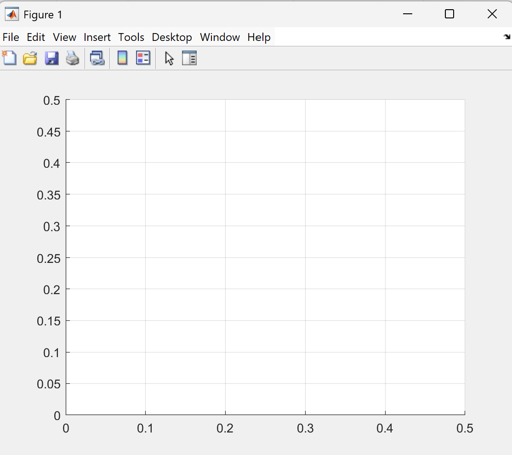
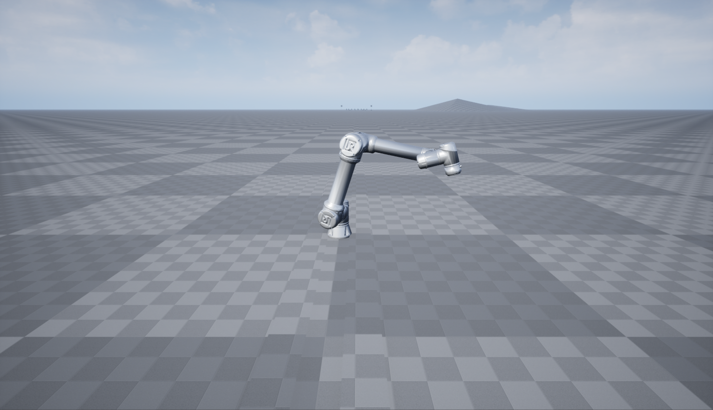

# UR5e Dynamic PD Control

Dynamic PD control and teleoperation framework for the **UR5e manipulator** in **MATLAB/Simulink**.

This project implements a simulation-based control architecture in which the robot end-effector is commanded in Cartesian space through a **Virtual Tablet** interface, while the manipulator is controlled in joint space through **inverse kinematics** and a **dynamic PD controller with model-based compensation**.

<p align="center">
  
</p>

## Overview

The objective of the project is to control a **UR5e collaborative manipulator** through an intuitive teleoperation interface.  
The operator assigns the end-effector reference in Cartesian space using a virtual tablet:

- **X-Y motion** follows the mouse position on the tablet plane
- **Z motion** is controlled through mouse click events

The control workflow is:

1. Cartesian reference generation through the Virtual Tablet
2. Inverse kinematics computation of the desired joint configuration
3. Joint-space dynamic control in Simulink
4. 3D visualization of the robot motion

## Main Components

- **`PD_gravity.slx`**  
  Main Simulink model implementing the robot control and dynamic simulation

- **`UR5e_init.m`**  
  Initialization script defining geometric, inertial, and dynamic parameters of the UR5e model

- **`virtual_tablet.m`**  
  MATLAB interface used to generate real-time Cartesian reference commands

## Control Strategy

The controller is implemented in **joint space** and is based on a **PD law with model-based compensation**.

The overall torque input is computed from:

- proportional action on the joint position error
- derivative damping
- gravity compensation
- dynamic compensation terms

The dynamic model follows the standard manipulator equation:

`B(q) q̈ + C(q, q̇) q̇ + g(q) + Fᵥ q̇ = τ`

where `B(q)` is the inertia matrix, `C(q, q̇) q̇` contains Coriolis and centrifugal terms, `g(q)` is the gravity contribution, and `Fᵥ q̇` models viscous friction.

The plot below shows a representative tracking-error output obtained during closed-loop simulation.

<p align="center">
  
</p>

## Virtual Tablet Interface

The file `virtual_tablet.m` provides a simple human-machine interface for real-time reference generation.

- The active tablet area is a **0.5 m × 0.5 m** Cartesian plane
- Mouse motion updates the **X-Y** reference
- Mouse click changes the **Z** reference between two predefined levels:
  - **z = 0.5 m**: safe position
  - **z = 0.1 m**: contact position

This interface allows intuitive teleoperation while keeping the control logic separated from the user input layer.

<p align="center">
  
</p>

## Robot Modeling

The UR5e manipulator is modeled in MATLAB using geometric and inertial parameters for all 6 links.

<p align="center">
  
</p>

The initialization script defines:

- link dimensions
- link masses
- centers of mass
- inertia tensors
- initial joint conditions

These data are used by Simulink to evaluate the robot dynamics during closed-loop simulation.

## Simulation Workflow

The simulation is organized as follows:

1. The Virtual Tablet generates the Cartesian target \(x, y, z\)
2. The inverse kinematics block computes the desired joint configuration \(q_d\)
3. The controller computes the input torque (τ)
4. The dynamic model updates joint accelerations, velocities, and positions
5. The resulting configuration is visualized in 3D

The end-effector orientation is constrained so that the tool points **downward**, which is suitable for planar interaction tasks.

## Requirements

- **MATLAB**
- **Simulink**
- **Robotics System Toolbox**

## How to Run

1. Open MATLAB in the repository folder
2. Run the initialization script

```matlab
UR5e_init
```
3. Start the Virtual Tablet interface
```matlab
virtual_tablet
```
4. Open the Simulink model
```matlab
open('PD_gravity.slx')
```
5. Run the simulation from Simulink
